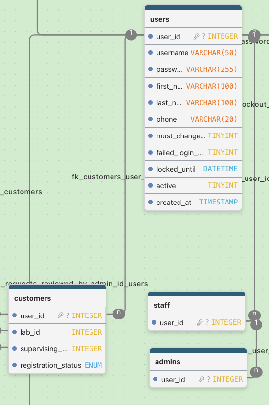
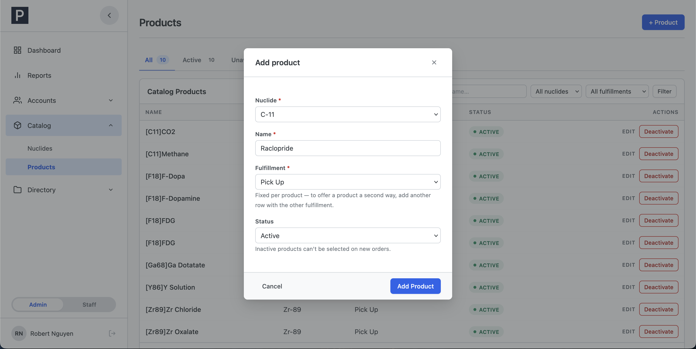
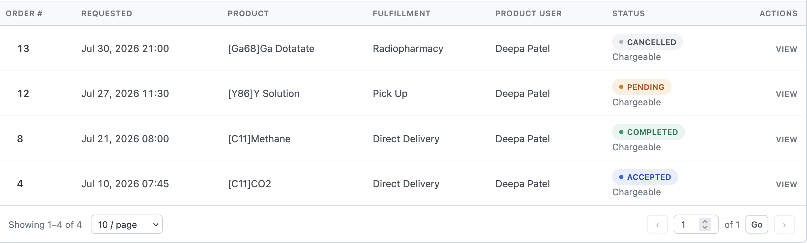
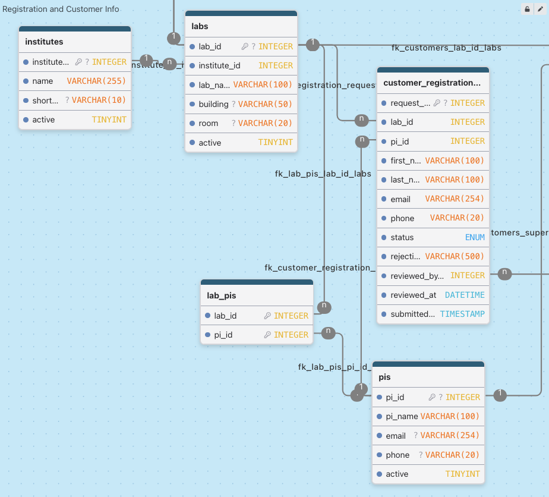

# PETOrders — Architecture & Conventions

Audience: the developer inheriting this codebase. This is the "what you
need to know before you change anything" doc: the shape of the app, the
rules that are deliberate, and the gotchas that already bit someone
once. Scannable, not exhaustive. The code and `sql/schema.sql` are the
reference for details.

---

## Contents

1. [Stack](#stack-and-the-zero-dependency-rule)
2. [Directory layout](#directory-layout)
3. [Role model](#role-model)
4. [Catalog model](#catalog-model)
5. [Order lifecycle](#order-lifecycle-the-state-machine)
6. [Directory model (institutes/labs/PIs)](#directory-model-institutes--labs--pis)
7. [Gotcha: layout scope leak](#gotcha-layout-partials-share-the-pages-variable-scope)
8. [Shared helpers](#shared-helpers-check-here-before-writing-new-logic)
9. [Security posture](#security-posture)
10. [UI conventions](#ui-conventions)
11. [Decisions, not gaps](#things-that-look-like-gaps-but-are-decisions)

---

## Stack, and the zero-dependency rule

| Layer           | Choice                                      |
| --------------- | ------------------------------------------- |
| Language        | PHP 7.4, plain. No framework, no ORM        |
| Database access | PDO, prepared statements throughout         |
| Database        | MariaDB 10.11 (InnoDB, utf8mb4)             |
| CSS             | Vanilla, system fonts                       |
| JS              | Vanilla, one `script.js`, no bundler        |
| Dependencies    | **None.** No Composer, no npm, no CDN       |

Every asset is local. The app makes no outbound requests and never sends
email. Deliberate constraint for the deployment environment. Don't add
dependencies.

## Directory layout

<details>
<summary>Full tree (click to expand)</summary>

```
public/            # ONLY web-reachable folder (Apache doc root)
  login.php, register.php, registration_status.php, change_password.php,
  index.php (redirects to /login.php), account_profile.php, 404.php
  customer/        # customer pages (dashboard, orders, order_detail,
                   #   new_order.php = POST-only JSON endpoint,
                   #   lab_delivery_locations, lab_product_users)
  staff/           # dashboard, orders.php (Order Queue), order_detail.php
  admin/           # dashboard, registrations, customers, accounts,
                   #   nuclides, products, institutes, labs, pis,
                   #   reports, export_csv
  assets/          # css/ (component library shared by all roles), js/script.js
src/               # application code, OUTSIDE the doc root, never URL-reachable
  config.php       # DB credentials (gitignored; template: config.sample.php)
  db.php           # get_db(): one memoized PDO per request
  auth.php         # login, lockout, sessions, require_role(), password policy
  helpers.php      # everything shared (see helper inventory below)
  partials/        # layouts, head, new-order form/modal, pagination
config/
  app_settings.php # static app-wide settings (display name); read via app_setting()
sql/               # schema.sql (source of truth), seed.sql (dev data)
tools/             # bootstrap_admin.php (production), set_temp_passwords.php (dev)
```

</details>


_Apache requests hit `public/` only. `src/` (with `config.php` and DB credentials), `sql/`, `tools/`, and `config/` sit outside the doc root and are unreachable by URL no matter what._

The doc-root split is a security boundary: `src/` holds DB credentials
and is structurally unreachable by URL. Never move application code into
`public/`.

## Role model

`users` has no role column. Role is membership in a marker table.



_`users` has no role column. Role comes from membership in `customers`, `staff`, or `admins` (a subset of `staff`). Customers are further scoped by `lab_id`._

| Table       | Notes                                                                                     |
| ----------- | ----------------------------------------------------------------------------------------- |
| `customers` | Carries `lab_id` and `supervising_pi_id`. A customer's whole world is scoped to their lab |
| `staff`     | Staff accounts                                                                            |
| `admins`    | FKs to `staff.user_id`. Every admin is also staff                                         |

`determine_role()` (src/auth.php) checks admins, then staff, then
customers, in that order. Admin satisfies staff-only checks
(`role_satisfies()`), never the reverse. Neither satisfies customer.

Self-registration never writes to `users`. It creates a row in
`customer_registration_requests`, and the account only gets created when
an admin approves it.

## Catalog model


_Availability is computed live, not cascaded. Both the nuclide and the product must be active for the product to be orderable. Deactivating either leaves rows untouched._

| Rule             | Detail                                                                                                                                                                                                                                  |
| ---------------- | --------------------------------------------------------------------------------------------------------------------------------------------------------------------------------------------------------------------------------------- |
| Terminology      | isotope became **nuclide**, compound became **product**                                                                                                                                                                                 |
| UI rename        | `delivery_method` column displays as **"Fulfillment"** (code/schema unchanged)                                                                                                                                                          |
| Delivery method  | Fixed property of the product row, never chosen per-order. One compound offered two ways = two product rows (unique key: name + nuclide + method)                                                                                       |
| Availability     | Computed, never cascaded: `products.active = 1 AND nuclides.active = 1`. Deactivating a nuclide makes its products unavailable without touching their rows. Both gates live in `get_new_order_form_data()` and `validate_order_input()` |
| Lock after use   | Once any order references a product, its nuclide and fulfillment lock (UI-disabled + server-enforced). Workflow: create a new product row, deactivate the old one. Renaming is always allowed                                           |
| Pricing          | None, anywhere. Deliberate                                                                                                                                                                                                              |
| Catalog scoping  | None, per lab. Every available product is visible to every lab. Deliberate                                                                                                                                                              |
| Naming collision | "product" (catalog item) vs. "product user" (dose recipient in `lab_product_users`). Don't rename either                                                                                                                                |

## Order lifecycle: the state machine


_Four states (pending, accepted, completed, cancelled), five transitions (accept, return, complete, cancel, reopen). Completed is the only terminal state._

| Transition | Who                                                      | Path                                |
| ---------- | -------------------------------------------------------- | ----------------------------------- |
| accept     | staff                                                    | pending → accepted                  |
| return     | staff                                                    | accepted → pending                  |
| complete   | staff                                                    | accepted → completed (**terminal**) |
| cancel     | customer (own pending order) or staff (pending/accepted) | → cancelled                         |
| reopen     | staff                                                    | cancelled → pending                 |

Hard rules:

| Rule               | Detail                                                                                                                                                                                                                                                                              |
| ------------------ | ----------------------------------------------------------------------------------------------------------------------------------------------------------------------------------------------------------------------------------------------------------------------------------- |
| Single path        | Every transition goes through `transition_order_status()` in `src/helpers.php`. Row-locks the order (`FOR UPDATE`), validates against the actor's role, writes the order update + `order_audit_log` row in one transaction. No call site bypasses it. Never invent a new transition |
| Cancel reason      | Required (`cancellation_reason`, 500 chars max), enforced inside `transition_order_status()`. Reopen clears it                                                                                                                                                                      |
| Audit log          | Status-only: order creation + each transition. No field-level diffing, don't add any                                                                                                                                                                                                |
| `chargeable`       | Independent of lifecycle. Staff-toggleable in any status, defaults true, deliberately not audit-logged. "Not chargeable" is the flagged exception in the UI, "Chargeable" is the quiet default                                                                                      |
| `notes`            | The only communication channel. One shared field, editable by staff always and by the customer on their own pending order, last-write-wins, no history, no staff-only channel                                                                                                       |
| Where actions live | Staff act on orders only from `staff/order_detail.php`. The Order Queue (`staff/orders.php`) is a pure triage list with no actions                                                                                                                                                  |

## Directory model (institutes / labs / PIs)


_Institutes contain labs. Labs and PIs are paired through `lab_pis`, managed only from the Lab modal in `admin/labs.php`._

| Rule            | Detail                                                                                                                                                                             |
| --------------- | ---------------------------------------------------------------------------------------------------------------------------------------------------------------------------------- |
| Availability    | Institute→lab mirrors nuclide→product: computed (`labs.active AND institutes.active`), no cascade writes                                                                           |
| Pairing UI      | Lab↔PI pairing lives in `lab_pis`, managed from one place only: the Lab modal's PI roster in `admin/labs.php`. `pis.php` has no pairing UI on purpose                              |
| `active` flags  | Gate only new-registration selection and changed-to assignments. Never affect existing customers or orders. Deactivating anything is always non-destructive                        |
| Admin edit rule | Keeping a customer's current lab + PI always saves (stale/inactive assignments never block an unrelated edit). Changing either requires the new lab and PI to be active and paired |
| Uniqueness      | Only `institutes.name` has a DB unique key. Lab and PI names are intentionally not unique                                                                                          |

## Gotcha: layout partials share the page's variable scope

The layouts (`src/partials/layout_customer.php` / `layout_staff.php` /
`layout_admin.php`) are plain `include`s executed mid-page, so any
variable they set lands in the including page's scope. This caused a
real bug: a layout's bare `$products`/`$locations` variables got
silently overwritten by a page that declared its own.

The fix, and the standing convention: everything a layout produces is
namespaced under a single `$petordersLayout` array (account identity,
current-page marker, sidebar state, and, for the customer layout, the
New Order modal's backing data).

| Before touching a layout                              | Do this                                                                                                  |
| ----------------------------------------------------- | -------------------------------------------------------------------------------------------------------- |
| Naming a variable on a page that includes a layout    | Check the layout for its reserved names first                                                            |
| `head.php`                                            | Expects `$pageTitle` from the caller                                                                     |
| Customer layout                                       | Reads a page-owned loose `$labId` (deliberate exception)                                                 |
| `customer/dashboard.php`, `customer/order_detail.php` | Read `$petordersLayout` fields after including the layout. Treat as an API surface if you touch the layouts |

## Shared helpers: check here before writing new logic

All in `src/helpers.php` unless noted:

| Helper                                                                        | Purpose                                                                                                                    |
| ----------------------------------------------------------------------------- | -------------------------------------------------------------------------------------------------------------------------- |
| `transition_order_status()`                                                   | the one lifecycle path (see above)                                                                                         |
| `validate_order_input()`                                                      | full order-form validation and normalization (lab scoping, direct-delivery location requirement, 24h HH:MM time)           |
| `get_new_order_form_data()`                                                   | nuclides/products/locations/product-users for the order form, availability-filtered                                        |
| `fetch_order_audit_trail()` / `describe_order_transition()`                   | audit feed and human-readable labels                                                                                       |
| `csrf_field()` / `verify_csrf()`                                              | CSRF token field and POST verification                                                                                     |
| `e()`                                                                         | HTML escaping (htmlspecialchars, ENT_QUOTES, UTF-8)                                                                        |
| `toast_flash()`                                                               | success toast after PRG redirect                                                                                           |
| `field_class()` / `field_error()`                                             | per-field validation display                                                                                               |
| `paginate()`                                                                  | clamped pagination math, consume its `rangeStart`/`rangeEnd`, don't recompute                                              |
| `form_action()` / `build_query()`                                             | list-page actions/links that preserve filter and page state                                                                |
| `bootstrap_session()`                                                         | hardened `session_start()` (httponly, samesite=Lax, secure per config). Every page uses this, never bare `session_start()` |
| `app_setting()`                                                               | reads `config/app_settings.php`                                                                                            |
| `csv_safe()`                                                                  | CSV formula-injection neutralization (used by the report export)                                                           |
| `customer_display_name()`, `delivery_method_label()`, `format_activity_mci()` | display formatting                                                                                                         |

Constants: `DEFAULT_PAGE_SIZE` (10) and `PAGE_SIZE_OPTIONS`
([10, 20, 50, 100]). Reuse, don't redefine.

One deliberate anti-DRY case: `generate_temp_password()` is duplicated
per-file (registrations, customer detail, account detail, bootstrap
tool) on purpose. Copy the shape, don't centralize it.

## Security posture

| Category        | Detail                                                                                                                                                                                                       |
| --------------- | ------------------------------------------------------------------------------------------------------------------------------------------------------------------------------------------------------------ |
| SQL             | PDO with real prepared statements (`ATTR_EMULATE_PREPARES = false`), exceptions on error, utf8mb4 DSN charset                                                                                                |
| CSRF            | Token on every POST, rotated at login                                                                                                                                                                        |
| Sessions        | httponly + SameSite=Lax cookies, `secure` when `REQUIRE_SECURE_COOKIES` is on, 15-minute idle timeout, session ID regenerated at login                                                                       |
| Login lockout   | 5 failed attempts locks for 15 minutes, deliberately invisible to the user (same generic message every time). Recorded in `lockout_events`, surfaced on the admin dashboard                                  |
| Password policy | 12+ chars, at least one letter and one number, can't contain the username/email, can't match the last 5 passwords (`password_history`). Admins trigger resets but never see or choose a user's real password |
| Every request   | `require_role()` re-checks `users.active` live, sets `Cache-Control: no-store`, `X-Frame-Options: DENY`, `X-Content-Type-Options: nosniff`, forces `/change_password.php` while a temp password is in effect |
| Errors          | `display_errors` off. Global exception handler logs and renders a generic 500 page                                                                                                                           |
| Timezone        | Pinned to `America/New_York` in code                                                                                                                                                                         |

## UI conventions

| Convention          | Detail                                                                                                                                 |
| ------------------- | -------------------------------------------------------------------------------------------------------------------------------------- |
| CSS                 | One shared component library for all three roles. No role-specific stylesheets                                                         |
| Success flow        | POST redirects (PRG), then toasts via `toast_flash()`                                                                                  |
| Errors              | Inline `.alert--error` plus per-field messages                                                                                         |
| Exception           | Temporary password reveals use a read-once session flash with a 60-second TTL, never a toast, never the URL                            |
| Destructive actions | `data-confirm*` attributes intercepted by `script.js` into a custom modal, never `window.confirm`                                      |
| List pages          | `.status-tabs` strip with live counts, explicit-submit filter forms (never live-as-you-type), shared pagination partial                |
| Create/edit modals  | One skeleton (copy `admin/nuclides.php`'s Add modal), dirty-tracking + discard-confirm. Modal shell intentionally not a shared partial |
| Order times         | 24-hour `HH:MM` text inputs (pattern-validated), never a native time picker. Real department requirement                               |
| Badges              | Dotted pills for statuses, square no-dot chips for facts (role, "Not chargeable")                                                      |

## Things that look like gaps but are decisions

Don't "fix" these. They're requirements:

| Missing                               | Status                                               |
| ------------------------------------- | ---------------------------------------------------- |
| Email sending                         | None, ever                                           |
| Cost/pricing fields                   | None                                                 |
| Phone-in-order flag                   | None                                                 |
| Per-order quantity limits             | None                                                 |
| Staff-only notes channel              | None                                                 |
| Field-level audit log                 | None                                                 |
| Category concept (products or staff)  | None                                                 |
| App-level uniqueness for lab/PI names | None                                                 |
| Customer profile self-edit            | Admin-only. Customers can only change their password |
