# PETOrders — Customer Guide

This guide is for lab members who use PETOrders to order products for
their lab. It walks through everything you can do, one task at a time.

A few things that apply everywhere:

- **Your view is your lab's view.** Orders placed by anyone in your lab
  show up in your lists and dashboard, and your lab-mates can see yours.
- **You are signed out after 15 minutes of inactivity.** If the app sends
  you back to the login page, that's usually why. Just log in again.
- **A small blue dot** next to an order means it's been updated since
  you last looked.

## Contents

1. [Registering for an account](#1-registering-for-an-account)
2. [Checking your registration status](#2-checking-your-registration-status)
3. [Logging in for the first time](#3-logging-in-for-the-first-time)
4. [Your dashboard](#4-your-dashboard)
5. [Placing a new order](#5-placing-a-new-order)
6. [Viewing and searching your lab's orders](#6-viewing-and-searching-your-labs-orders)
7. [Editing a pending order](#7-editing-a-pending-order)
8. [Adding or editing notes on an order](#8-adding-or-editing-notes-on-an-order)
9. [Cancelling an order](#9-cancelling-an-order)
10. [Managing delivery locations](#10-managing-delivery-locations)
11. [Managing product users](#11-managing-product-users)
12. [Your account info and password](#12-your-account-info-and-password)

---

## 1. Registering for an account

If you don't have an account yet, go to the login page and click
**Register here**.

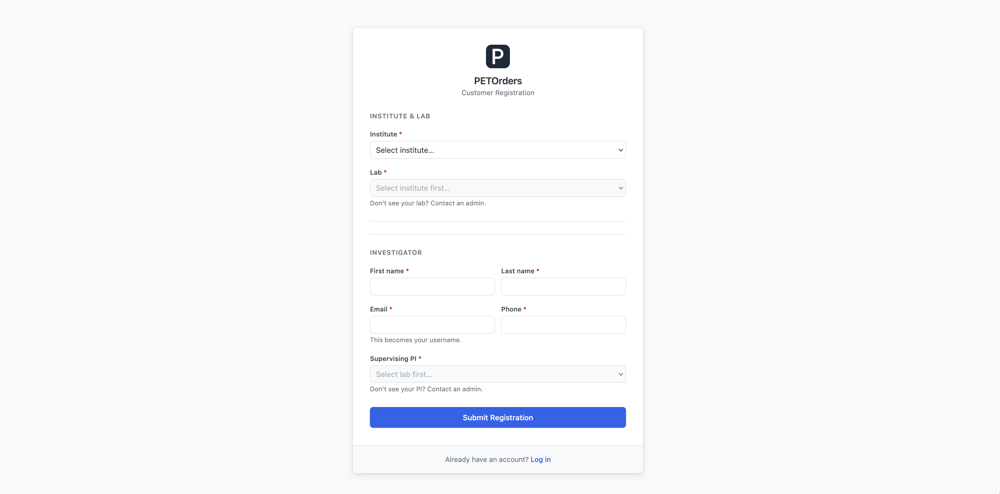
_The registration form. Pick your institute first, the lab list fills in based on your institute, and the PI list fills in based on your lab._

Fill in every field:

| Field                  | Notes                                                                                                                                   |
| ---------------------- | --------------------------------------------------------------------------------------------------------------------------------------- |
| Institute              | Your NIH institute or center                                                                                                            |
| Lab                    | Your lab (the list shows labs at the institute you picked). If your lab isn't listed, contact an administrator                          |
| First name / Last name |                                                                                                                                         |
| Email                  | Your email address. This becomes your username for logging in                                                                          |
| Phone                  | A number where you can be reached                                                                                                       |
| Supervising PI         | The principal investigator you work under (the list shows PIs at the lab you picked). If your PI isn't listed, contact an administrator |

Click **Submit Registration**. You'll see a confirmation that your
request was submitted. An administrator reviews it, and once approved,
your login details arrive by NIH email.

## 2. Checking your registration status

From the login page, click **Check your status**, enter the email you
registered with, and click **Check Status**.

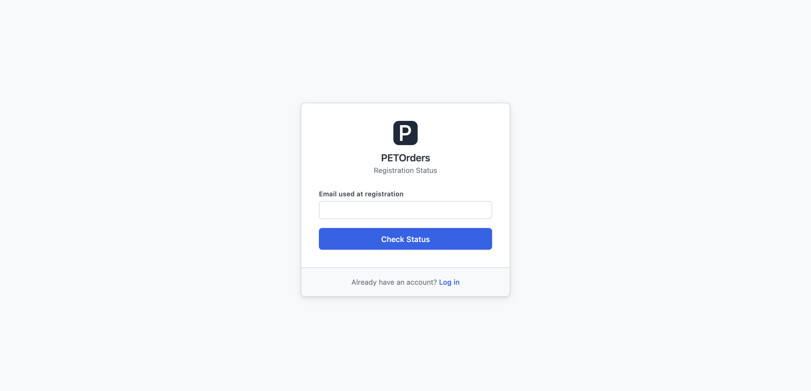
_The status page tells you whether your registration is Pending, Approved, or Rejected._

| Status   | Meaning                                                                                                                        |
| -------- | ------------------------------------------------------------------------------------------------------------------------------ |
| Pending  | An administrator hasn't reviewed it yet                                                                                        |
| Approved | You're in. Your login details come from an administrator via NIH email. If you haven't received them, contact an administrator |
| Rejected | Your request wasn't approved. Contact an administrator for details. You're welcome to submit a new registration                |

## 3. Logging in for the first time

Go to the login page and enter your username (your email address) and
the temporary password the administrator sent you.

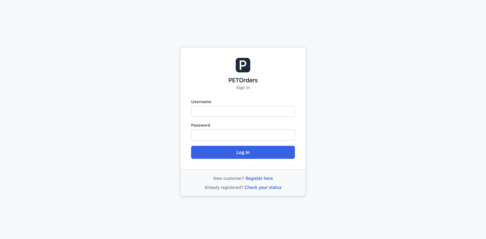
_The PETOrders login page._

Because your first password is temporary, you'll be taken straight to a
Change Password screen before anything else:

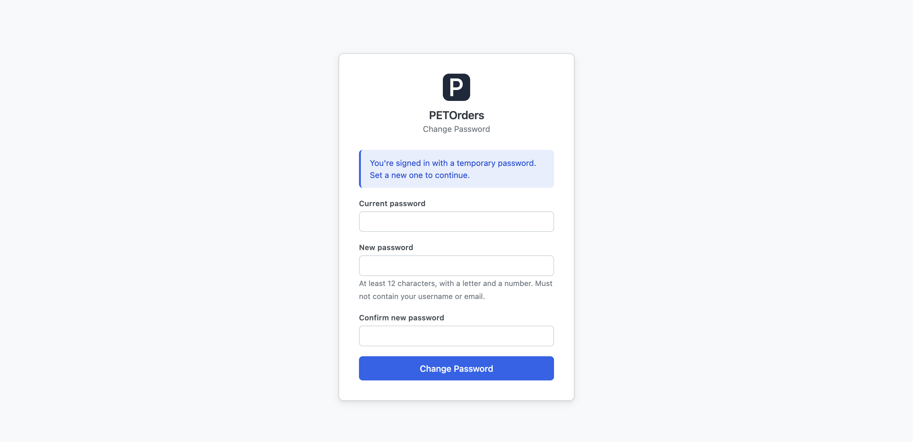
_Set your real password here. You'll use it from now on._

Your new password must be at least 12 characters and include at least
one letter and one number. It can't contain your username, and it can't
be one you've used recently.

Two things to know about logging in:

- If you see "Invalid username or password," check both carefully and
  try again.
- After several wrong attempts in a row, logins for your account stop
  working for about 15 minutes, even with the right password. If you're
  sure your password is correct but it isn't working, wait 15 minutes
  and try again.

## 4. Your dashboard

After logging in you land on your dashboard.

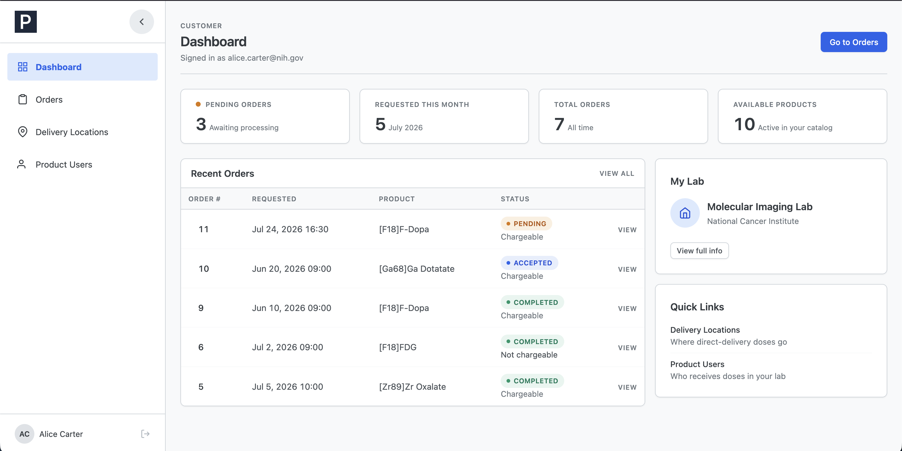
_The dashboard: your lab's order counts on top, recent orders below, and your lab info and quick links on the right._

| Section       | What it shows                                                                                                                                                              |
| ------------- | -------------------------------------------------------------------------------------------------------------------------------------------------------------------------- |
| Stat tiles    | Pending Orders, Requested This Month, and Total Orders for your whole lab (click one to jump to that filtered list), plus a count of products currently available to order |
| Recent Orders | Your lab's five most recent orders. Click **View** to open one                                                                                                             |
| My Lab        | Your lab and institute, with a **View full info** button showing your full account details                                                                                 |
| Quick Links   | Shortcuts to Delivery Locations and Product Users (sections 10 and 11)                                                                                                     |

## 5. Placing a new order

Go to **Orders** in the sidebar, then click **+ New Order**. The order
form opens on top of the page.

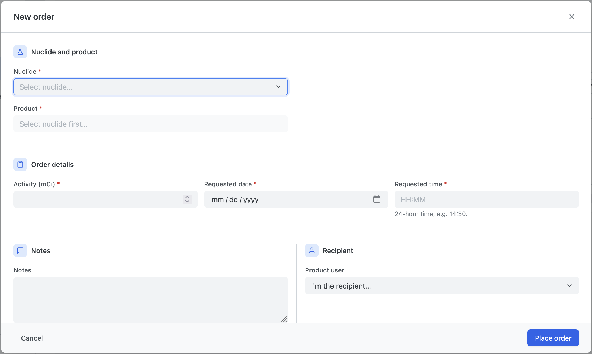
_The New Order form. Fields appear in the order you fill them: nuclide first, then product, then the details._

Work top to bottom:

1. **Nuclide**, pick the nuclide first. The product list depends on it.
2. **Product**, pick the product. Each option shows how it's fulfilled
   (Radiopharmacy, Pick Up, or Direct Delivery). Fulfillment is fixed
   per product. If the same product appears twice, that's two
   fulfillment options, pick the one you need.
3. **Delivery location**, this field only appears when you've picked a
   Direct Delivery product. Choose where in your lab the dose should
   go. If the list is empty, there's a link to add a location first
   (see section 10).

   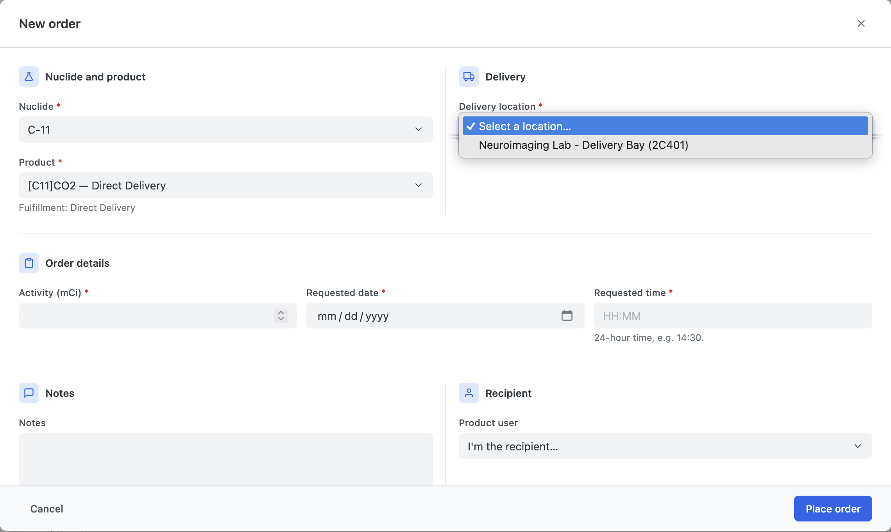
   _The Delivery section appears only for Direct Delivery products._

4. **Activity (mCi)**, the requested activity.
5. **Requested date**, pick the date.
6. **Requested time**, type the time in 24-hour format, like `14:30`
   for 2:30 PM.
7. **Notes** (optional), anything staff should know about this order,
   up to 500 characters. For special requests (for example,
   cyclotron-run specifics), this is the place to put them.
8. **Product user** (optional), who will receive the dose. Leave it on
   "I'm the recipient..." if it's you, or pick someone from your lab's
   product user list (see section 11).

Click **Place order**. You'll be asked to confirm:

_One last check before the order is submitted._

After confirming, you land on the new order's page with an "Order
placed." message. The order starts out Pending, staff take it from
there.

If you close the form partway through, you'll be asked whether to
discard what you entered, so you won't lose work to a stray click.

## 6. Viewing and searching your lab's orders

Click **Orders** in the sidebar to see every order placed by your lab.

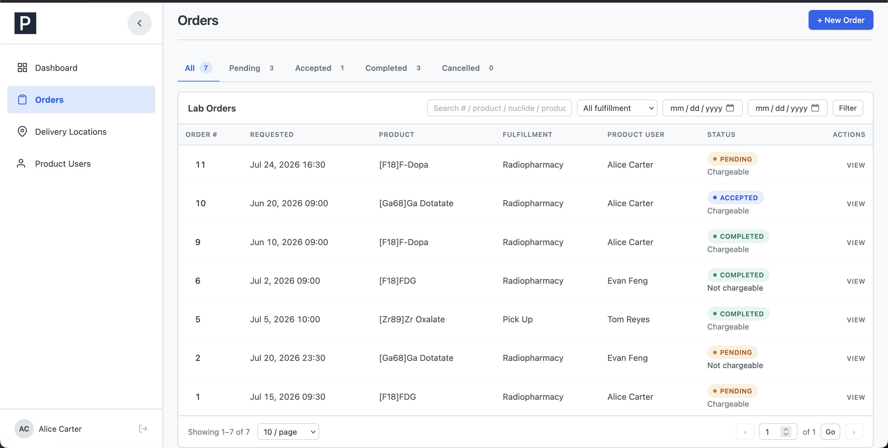
_The Orders page: status tabs across the top, search and filters below, and the order list underneath._

| Control            | What it does                                                                                               |
| ------------------ | ---------------------------------------------------------------------------------------------------------- |
| Status tabs        | All, Pending, Accepted, Completed, Cancelled, each with a count. Click a tab to filter                     |
| Search box         | Find orders by order number, product, nuclide, or product user name. Type your search and click **Filter** |
| Fulfillment filter | Narrow to Radiopharmacy, Pick Up, or Direct Delivery orders                                                |
| Date range         | Show orders requested between two dates                                                                    |

Click **View** on any row to open the order. If the list is long, use
the page controls at the bottom.

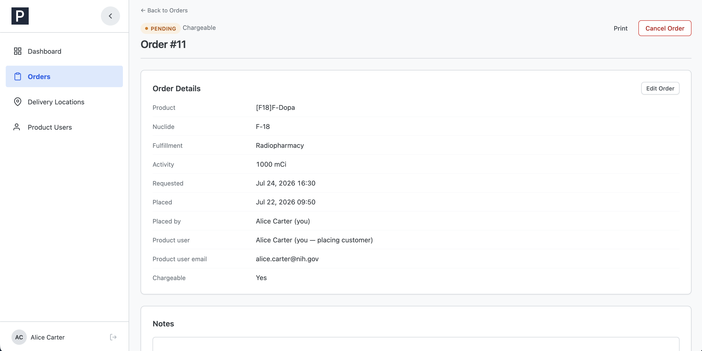
_An order's detail page: status at the top, full order details below, and a Print button for a paper copy._

## 7. Editing a pending order

Open one of your own orders while it's still Pending and you'll see an
**Edit Order** button on the details card. (Orders your lab-mates
placed, and orders that staff have already accepted, can't be edited. If
something needs to change on those, put it in the Notes or contact
staff.)

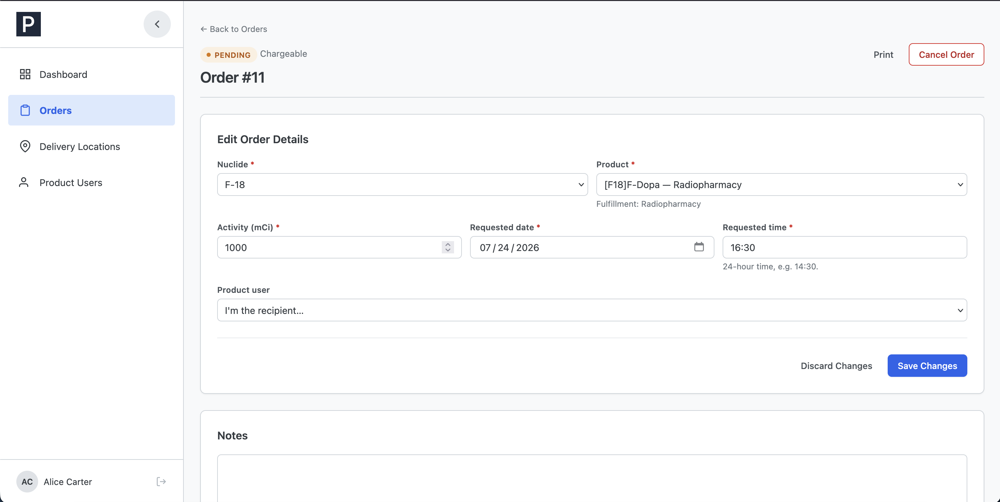
_Editing a pending order, the same fields as the order form._

Change what you need: nuclide, product, delivery location, activity,
date, time, or product user, and click **Save Changes**, then confirm.
**Discard Changes** backs out without saving.

## 8. Adding or editing notes on an order

Every order has a Notes card. On your own pending orders you can edit
it: type your note (up to 500 characters) and click **Save Notes**.

_Notes are shared between you and the staff processing the order._

Notes are one shared field on the order. Staff read and can update the
same text. If you're adding to an existing note, add your text rather
than replacing what's there.

## 9. Cancelling an order

You can cancel your own orders while they're Pending. Open the order and
click **Cancel Order** in the top-right.

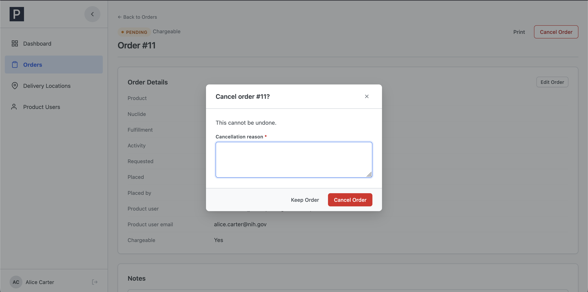
_Cancelling always requires a reason._

Type the reason for cancelling (required) and click **Cancel Order**, or
**Keep Order** to back out. The order moves to Cancelled, and the reason
is saved on the order for everyone to see.

If you cancel by mistake, contact staff, they can reopen a cancelled
order.

Once staff have accepted an order, you can no longer cancel it yourself.
Contact staff and they can cancel it for you (staff will also record a
reason).

## 10. Managing delivery locations

Delivery locations are the spots in your lab where Direct Delivery
orders are dropped off. Manage them under **Delivery Locations** in the
sidebar.

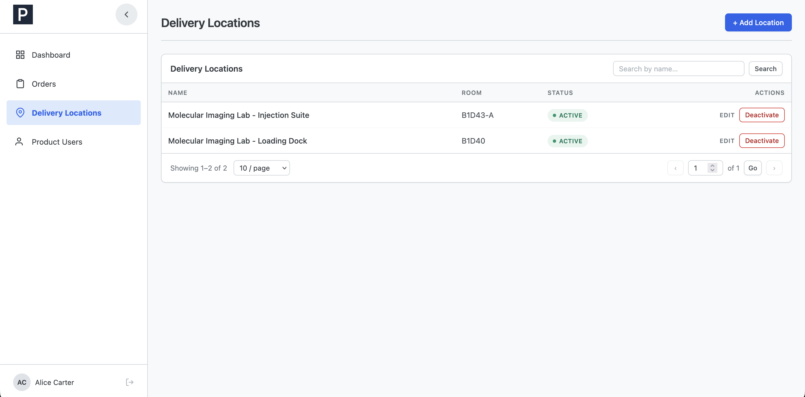
_Your lab's delivery locations. Only Active locations can be picked on new orders._

| Action                | Detail                                                                                                                          |
| --------------------- | ------------------------------------------------------------------------------------------------------------------------------- |
| Add                   | Click **+ Add Location**, enter a Name (required) and Room (optional), click **Add Location**                                   |
| Edit                  | Click Edit on a row to change its name or room                                                                                  |
| Deactivate / Activate | Deactivating removes it from the choices on new orders. Doesn't touch past orders, nothing is ever deleted. Reactivate any time |

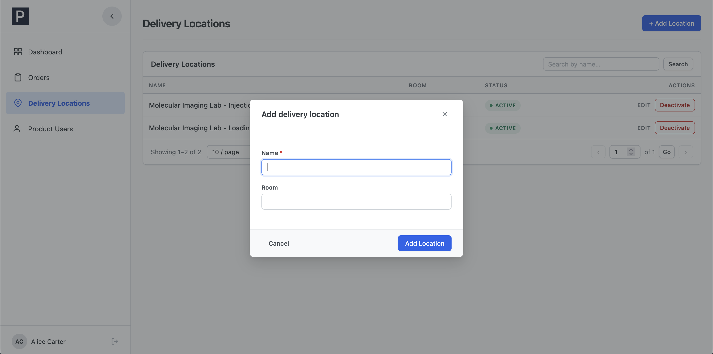
_Adding a delivery location, just a name and an optional room._

## 11. Managing product users

Product users are people in your lab who receive doses but don't log in
to PETOrders themselves. When you place an order, you can name one of
them as the recipient. Manage the list under **Product Users** in the
sidebar.

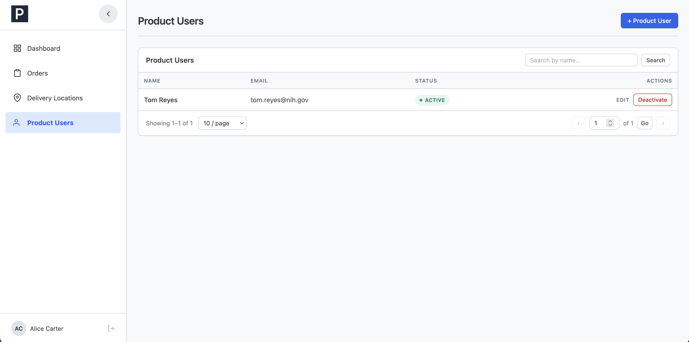
_Your lab's product users. Only Active product users can be picked on new orders._

| Action                | Detail                                                                                                                               |
| --------------------- | ------------------------------------------------------------------------------------------------------------------------------------ |
| Add                   | Click **+ Product User**, enter First name, Last name, and Email (all required, each email can only be used once in your lab's list) |
| Edit                  | Click Edit on a row to update their details                                                                                          |
| Deactivate / Activate | Removes them from the recipient choices on new orders, without affecting past orders. Reactivate any time                            |

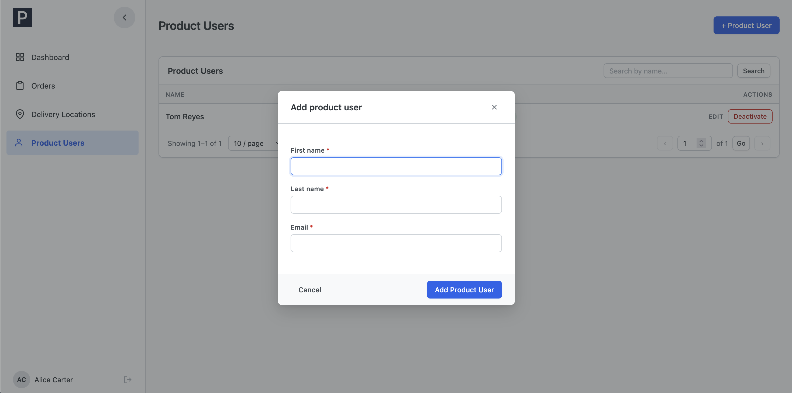
_Adding a product user._

## 12. Your account info and password

Click your name at the bottom of the sidebar to open My Info: your
name, username, phone, lab, institute, and supervising PI.

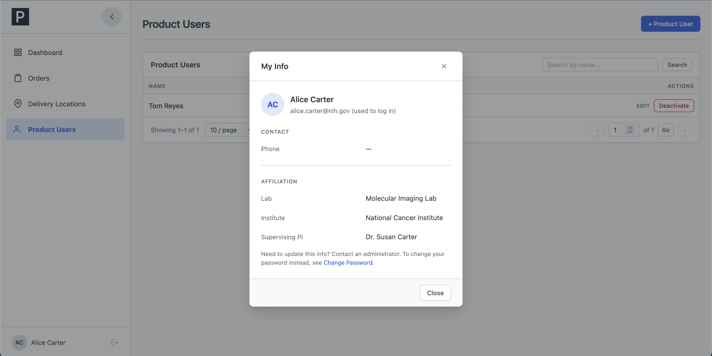
_My Info is view-only. To change any of these details, contact an administrator._

This information is view-only. If your lab, PI, phone, or name changes,
an administrator makes the update for you.

The one thing you manage yourself is your password, use **Change
Password** (linked from My Info). You'll need your current password,
and the new one follows the same rules as in section 3.
