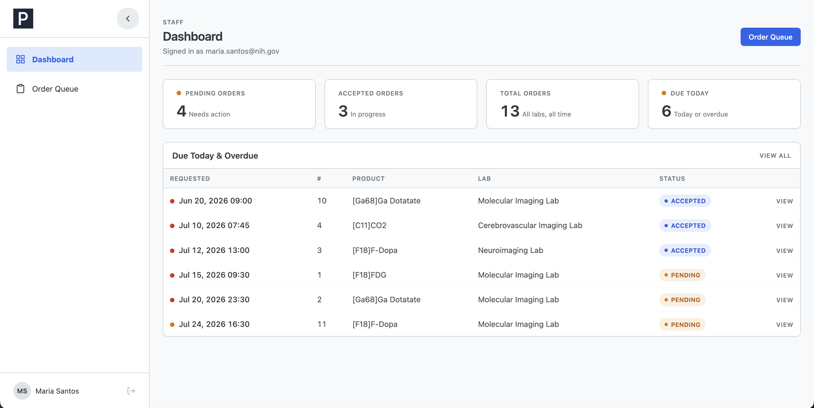
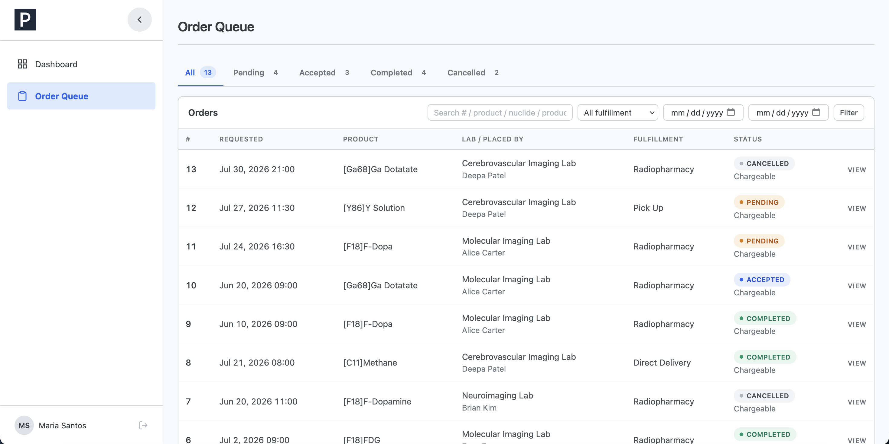
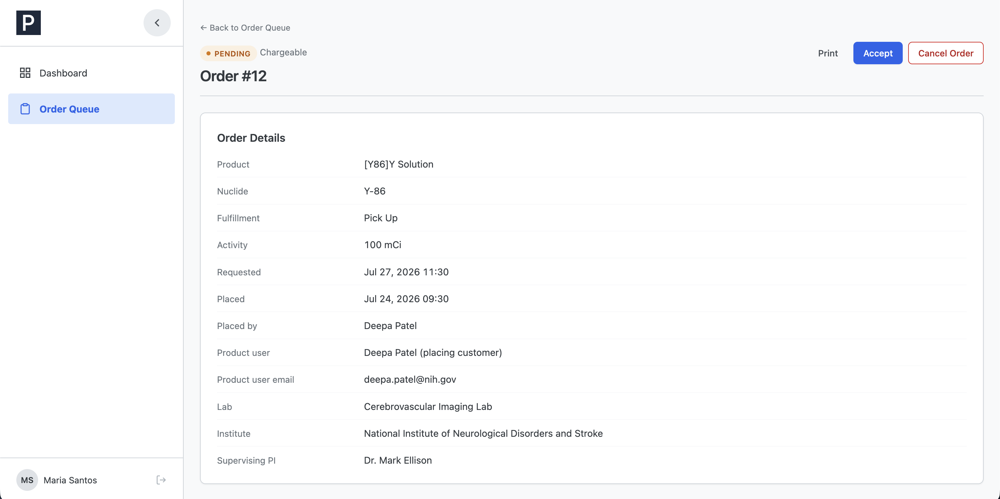
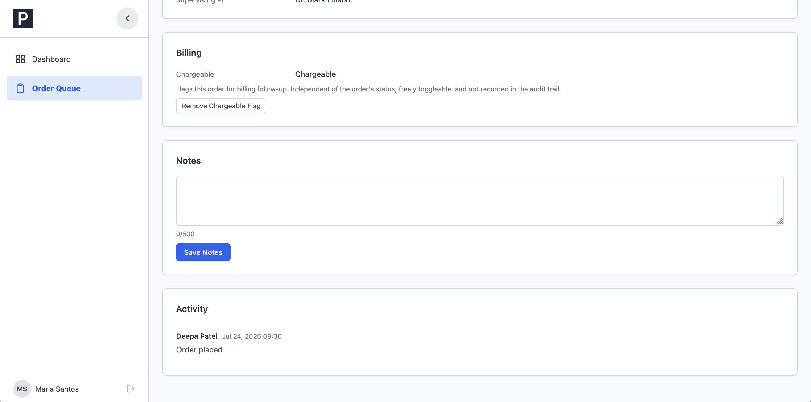
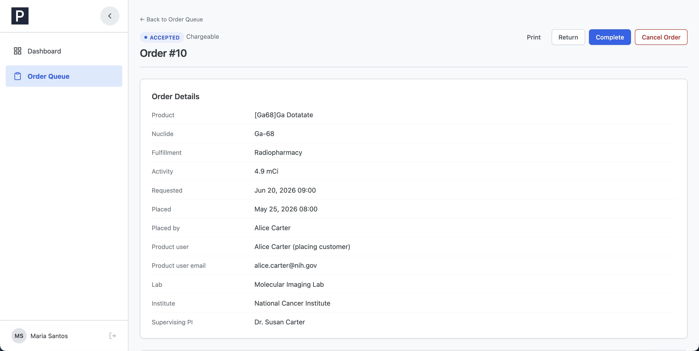
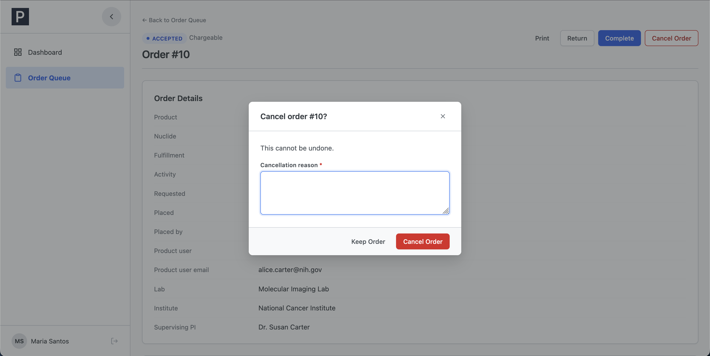
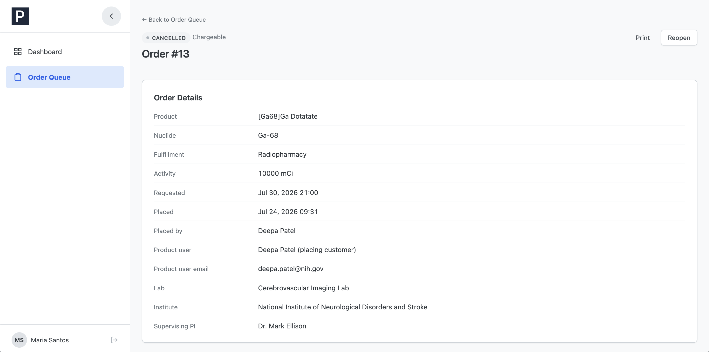
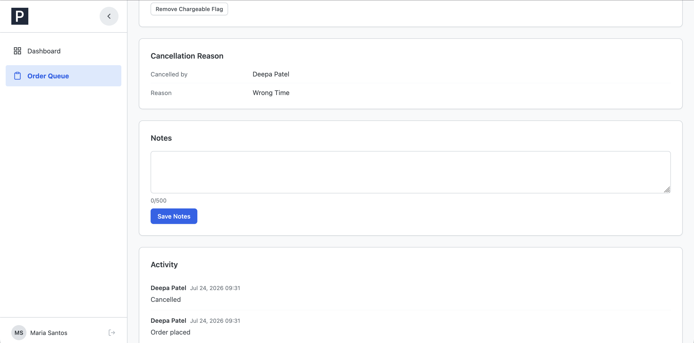
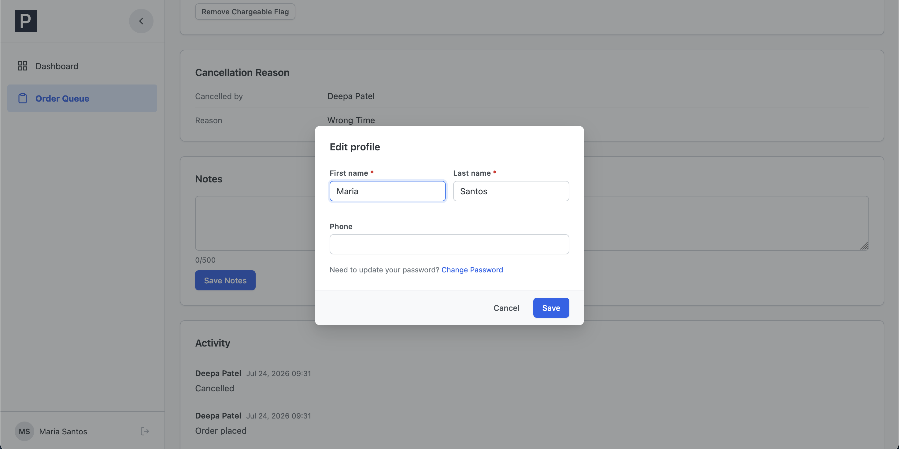

# PETOrders — Staff Guide

This guide is for staff who process customer orders in PETOrders. Staff
see and can act on every order from every lab.

The short version of the workflow: orders come in as Pending, you Accept
the ones you're working on, when the dose is delivered you mark them
Complete. Everything else (returning, cancelling, reopening) handles the
exceptions.

A couple of things that apply everywhere:

- You are signed out after 15 minutes of inactivity. Log back in and
  continue.
- Actions live on the order detail page. The Order Queue is for finding
  orders, not acting on them.

## Contents

1. [Your dashboard](#1-your-dashboard)
2. [The Order Queue](#2-the-order-queue)
3. [The order detail page](#3-the-order-detail-page)
4. [Accepting an order](#4-accepting-an-order)
5. [Returning an order to pending](#5-returning-an-order-to-pending)
6. [Completing an order](#6-completing-an-order)
7. [Cancelling an order](#7-cancelling-an-order)
8. [Reopening a cancelled order](#8-reopening-a-cancelled-order)
9. [The Chargeable flag](#9-the-chargeable-flag)
10. [Notes](#10-notes)
11. [Your profile and password](#11-your-profile-and-password)

---

## 1. Your dashboard

_The staff dashboard: counts across all labs, and the orders that need attention today._

| Section             | What it shows                                                                                                                                                                                                   |
| ------------------- | --------------------------------------------------------------------------------------------------------------------------------------------------------------------------------------------------------------- |
| Stat tiles          | Pending Orders (needs action), Accepted Orders (in progress), Total Orders, and Due Today (pending or accepted orders requested for today, or already overdue). Click a tile to jump to that slice of the queue |
| Due Today & Overdue | The same urgent orders as a list. A red dot on the requested time means the order is overdue, an amber dot means it's due later today. Click **View** to open one                                               |

## 2. The Order Queue

**Order Queue** in the sidebar lists every order in the system. It's a
triage list, you find and prioritize here, then open an order to act on
it.

_The Order Queue shows all orders as a triage list. Click any row to open its detail page._

| Feature     | Detail                                                                                                                                                                   |
| ----------- | ------------------------------------------------------------------------------------------------------------------------------------------------------------------------ |
| Status tabs | All, Pending, Accepted, Completed, Cancelled, each with a live count                                                                                                     |
| Search      | Matches order number, product, nuclide, product user, lab, PI, or institute. Combine with the fulfillment dropdown and requested date range, then click **Filter**       |
| Sorting     | Built for the work: Pending and Accepted tabs show the soonest-requested orders first (most urgent on top). Completed and Cancelled show the most recently updated first |
| Row info    | Lab and who placed the order, fulfillment method, status, and whether it's chargeable ("Not chargeable" stands out, "Chargeable" is the quiet default)                   |

Click **View** on a row to open the order.

## 3. The order detail page

_A pending order: status and order number on top, action buttons top-right, and the order's cards below._

Top of the page: the status badge, the chargeable state, and the action
buttons for the order's current status (covered in sections 4 through
8). A Print button is always available for a paper copy.

The cards, top to bottom:

| Card                | Contents                                                                                                                                                                          |
| ------------------- | --------------------------------------------------------------------------------------------------------------------------------------------------------------------------------- |
| Order Details       | Product, nuclide, fulfillment, activity, requested date/time, when and by whom it was placed, the product user (recipient), and the customer's lab, institute, and supervising PI |
| Delivery            | Only on Direct Delivery orders: where in the lab the dose goes                                                                                                                    |
| Billing             | The Chargeable flag (section 9)                                                                                                                                                   |
| Cancellation Reason | Only on cancelled orders: who cancelled and why                                                                                                                                   |
| Notes               | The shared communication field (section 10)                                                                                                                                       |
| Activity            | The order's history, newest first: placed, accepted, returned, completed, cancelled, reopened, each with who did it and when                                                      |

_The Activity card records every status change with the person and time._

## 4. Accepting an order

When: a Pending order you're taking on for processing.

On a pending order, click **Accept** and confirm. The order moves to
Accepted, it's now marked as in progress, the customer can no longer
edit or cancel it themselves, and it stays yours to complete, return, or
cancel.

## 5. Returning an order to pending

When: an Accepted order that shouldn't be in progress after all,
accepted by mistake, or it can't be fulfilled right now.

On an accepted order, click **Return** and confirm. The order goes back
to Pending in the queue, and the customer regains the ability to edit or
cancel it.

_An accepted order offers Return, Complete, and Cancel Order._

## 6. Completing an order

When: the order has been fulfilled, the dose was delivered or picked up.

On an accepted order, click **Complete** and confirm. This is final: a
completed order can never change status again, there is no undo and no
reopen. If you're not certain, leave it accepted until you are.

## 7. Cancelling an order

When: an order that won't be fulfilled, the customer asked, the run was
scrapped, or it can't be produced. Staff can cancel any Pending or
Accepted order.

Click **Cancel Order**. A dialog asks for a cancellation reason, it's
required, and it's saved on the order where the customer will see it,
so write it for them.

_Cancelling always requires a reason. The customer sees it on the order, attributed to "Staff"._

Click **Cancel Order** to confirm or **Keep Order** to back out. The
order moves to Cancelled. (Customers can also cancel their own pending
orders themselves, those show the customer's name as the canceller.)

## 8. Reopening a cancelled order

When: a cancellation turned out to be a mistake, or the order is back
on.

On a cancelled order, click **Reopen** and confirm. The order returns to
Pending (not Accepted, it re-enters the queue from the start), and the
old cancellation reason is cleared.

_A cancelled order shows who cancelled it and why, and offers Reopen._

## 9. The Chargeable flag

Every order is Chargeable by default. The flag marks orders for billing
follow-up and is completely separate from the order's status, you can
toggle it on any order, in any status, at any time.

_The Billing card. The button reads "Remove Chargeable Flag" or "Mark as Chargeable" depending on the current state._

Click **Remove Chargeable Flag** to mark an order not chargeable (it
gets a highlighted "Not chargeable" badge everywhere), or **Mark as
Chargeable** to restore the default. There's no confirmation dialog, and
the change is not recorded in the Activity trail, it's a bookkeeping
flag, not part of the order's history.

## 10. Notes

The Notes card is the one shared message field on an order, you and the
customer both read and write the same text (up to 500 characters).
Staff can edit notes on any order, in any status: type and click **Save
Notes**.

_Notes are shared with the customer, and saving replaces the previous text._

Because saving replaces what was there (there's no history), add to the
existing text rather than overwriting it, and keep in mind the customer
sees everything you write.

## 11. Your profile and password

Click your name at the bottom of the sidebar to open your profile,
where you can update your name and phone. Your username and role are
fixed, an admin manages those.

_Your profile: name and phone are yours to edit._

To change your password, use **Change Password** (you'll need your
current one, new passwords are at least 12 characters with a letter and
a number). If you've forgotten your password entirely, an admin can
issue you a new temporary one.
